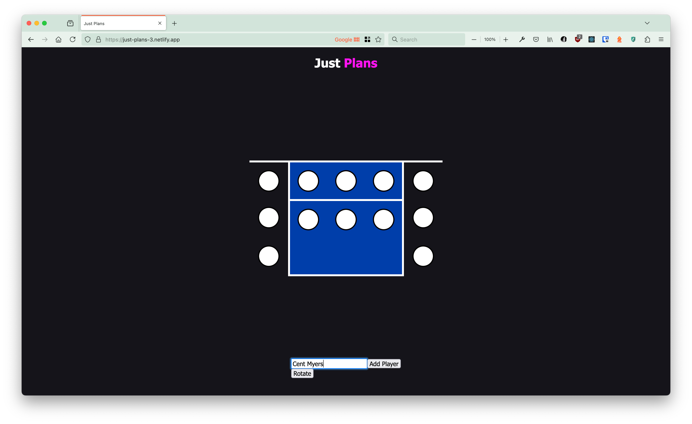
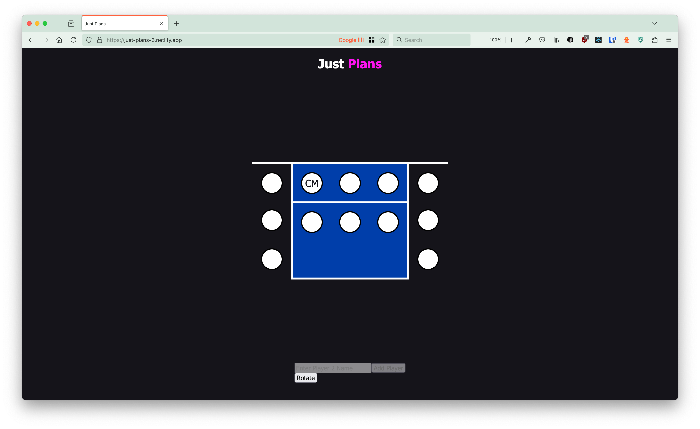
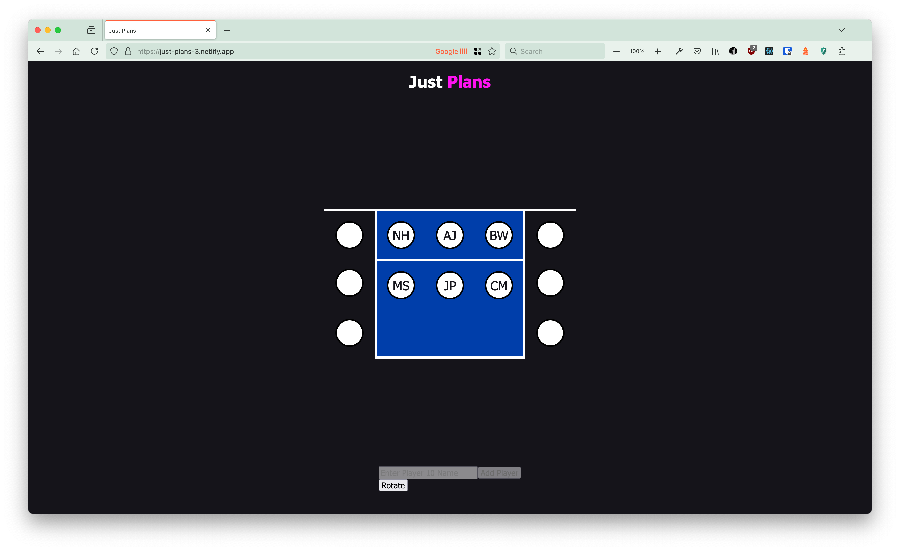

<!-- Improved compatibility of back to top link: See: https://github.com/othneildrew/Best-README-Template/pull/73 -->

<a id="readme-top"></a>

<!--
*** Thanks for checking out the Best-README-Template. If you have a suggestion
*** that would make this better, please fork the repo and create a pull request
*** or simply open an issue with the tag "enhancement".
*** Don't forget to give the project a star!
*** Thanks again! Now go create something AMAZING! :D
-->

<!-- PROJECT SHIELDS -->
<!--
*** I'm using markdown "reference style" links for readability.
*** Reference links are enclosed in brackets [ ] instead of parentheses ( ).
*** See the bottom of this document for the declaration of the reference variables
*** for contributors-url, forks-url, etc. This is an optional, concise syntax you may use.
*** https://www.markdownguide.org/basic-syntax/#reference-style-links
-->

[![Contributors][contributors-shield]][contributors-url]
[![Forks][forks-shield]][forks-url]
[![Stargazers][stars-shield]][stars-url]
[![Issues][issues-shield]][issues-url]
[![GNU GPLv3][license-shield]][license-url]

<!-- [![LinkedIn][linkedin-shield]][linkedin-url] -->

<!-- PROJECT LOGO -->
<br />
<div align="center">

<h3 align="center">Just Plans</h3>

  <p align="center">
    A position planner for volleyball!
    <br />
    <a href="https://github.com/centanomics/just-plans-3"><strong>Explore the docs »</strong></a>
    <br />
    <br />
    <a href="https://just-plans-3.netlify.app/">View Demo</a>
    &middot;
    <a href="https://github.com/centanomics/just-plans-3/issues/new?labels=bug&template=bug-report---.md">Report Bug</a>
    &middot;
    <a href="https://github.com/centanomics/just-plans-3/issues/new?labels=enhancement&template=feature-request---.md">Request Feature</a>
  </p>
</div>

<!-- TABLE OF CONTENTS -->
<details>
  <summary>Table of Contents</summary>
  <ol>
    <li>
      <a href="#about-the-project">About The Project</a>
      <ul>
        <li><a href="#built-with">Built With</a></li>
      </ul>
    </li>
    <li>
      <a href="#getting-started">Getting Started</a>
      <ul>
        <li><a href="#prerequisites">Prerequisites</a></li>
        <li><a href="#installation">Installation</a></li>
      </ul>
    </li>
    <li><a href="#usage">Usage</a></li>
    <li><a href="#roadmap">Roadmap</a></li>
    <li><a href="#contributing">Contributing</a></li>
    <li><a href="#license">License</a></li>
    <li><a href="#contact">Contact</a></li>
    <li><a href="#acknowledgments">Acknowledgments</a></li>
  </ol>
</details>

<!-- ABOUT THE PROJECT -->

## About The Project

[![Just Plans Screen Shot][product-screenshot]](https://just-plans-3.netlify.app/)


<p align="right">(<a href="#readme-top">back to top</a>)</p>

### Built With

- [![Gatsby][Gatsby]][Gatsby-url]
- [![React][React.js]][React-url]

<p align="right">(<a href="#readme-top">back to top</a>)</p>

<!-- GETTING STARTED -->

## Getting Started

To get a local copy up and running follow these simple steps.

### Prerequisites

- npm
  ```sh
  npm install npm@latest -g
  ```
- gatsby-cli
  ```sh
  npm install gatsby-cli -g
  ```  

### Installation

1. Clone the repo
   ```sh
   git clone https://github.com/centanomics/just-plans-3
   ```
2. cd into the created project
	```sh
	cd just-plans-3
	```
3. Install NPM packages
   ```sh
   npm install
   ```
4. Change git remote url to avoid accidental pushes to base project
   ```sh
   git remote set-url origin centanomics/just-plans-3
   git remote -v # confirm the changes
   ```

<p align="right">(<a href="#readme-top">back to top</a>)</p>

<!-- USAGE EXAMPLES -->

## Usage

1. You can add a users full name to a spot, then it will show up in said spot with their initials filling the space
	- Click on a white circle 
	- Enter the players name in the input 
	- Click Add player to add that players initials to the court 
2. Once two or more spots are filled out you can then rotate the players (follows a clockwise rotation)
	- Click on the rotate button 
	- All of the players have rotated once clockwise 

<p align="right">(<a href="#readme-top">back to top</a>)</p>

<!-- ROADMAP -->

## Roadmap

- [x] Add users to a court and rotate them
- [ ] Allow users to save positions when closing the browser
- [ ] Can choose the max team size (includes players out)
- [ ] Can choose the type of rotation (one where you dont care about volleyball positions vs you do)

See the [open issues](https://github.com/github_username/repo_name/issues) for a full list of proposed features (and known issues).

<p align="right">(<a href="#readme-top">back to top</a>)</p>

<!-- CONTRIBUTING -->

## Contributing

Contributions are what make the open source community such an amazing place to learn, inspire, and create. Any contributions you make are **greatly appreciated**.

If you have a suggestion that would make this better, please fork the repo and create a pull request. You can also simply open an issue with the tag "enhancement".
Don't forget to give the project a star! Thanks again!

1. Fork the Project
2. Create your Feature Branch (`git checkout -b feature/AmazingFeature`)
3. Commit your Changes (`git commit -m 'Add some AmazingFeature'`)
4. Push to the Branch (`git push origin feature/AmazingFeature`)
5. Open a Pull Request

<p align="right">(<a href="#readme-top">back to top</a>)</p>

### Top contributors:

<a href="https://github.com/centanomics/just-plans-3/graphs/contributors">
  
</a>

<!-- LICENSE -->

## License

Distributed under the GNU General Public License v3.0. See `LICENSE.txt` for more information.

<p align="right">(<a href="#readme-top">back to top</a>)</p>

<!-- CONTACT -->

## Contact

Cent - [@centanomics](https://twitter.com/centanomics) - centanomics@gmail.com

Project Link: [https://github.com/centanomics/just-plans-3](https://github.com/centanomics/just-plans-3)

<p align="right">(<a href="#readme-top">back to top</a>)</p>

<!-- ACKNOWLEDGMENTS -->

## Acknowledgments

- My Friend Andrew for complaining about how mid volleyball tools were
- The sport of Volleyball
- The Bird high in the sky who "stress tests" my site

<p align="right">(<a href="#readme-top">back to top</a>)</p>

<!-- MARKDOWN LINKS & IMAGES -->
<!-- https://www.markdownguide.org/basic-syntax/#reference-style-links -->

[contributors-shield]: https://img.shields.io/github/contributors/centanomics/just-plans-3.svg?style=for-the-badge
[contributors-url]: https://github.com/centanomics/just-plans-3/graphs/contributors
[forks-shield]: https://img.shields.io/github/forks/centanomics/just-plans-3.svg?style=for-the-badge
[forks-url]: https://github.com/centanomics/just-plans-3/network/members
[stars-shield]: https://img.shields.io/github/stars/centanomics/just-plans-3.svg?style=for-the-badge
[stars-url]: https://github.com/centanomics/just-plans-3/stargazers
[issues-shield]: https://img.shields.io/github/issues/centanomics/just-plans-3.svg?style=for-the-badge
[issues-url]: https://github.com/centanomics/just-plans-3/issues
[license-shield]: https://img.shields.io/github/license/centanomics/just-plans-3.svg?style=for-the-badge
[license-url]: https://github.com/centanomics/just-plans-3/blob/master/LICENSE.txt
[linkedin-shield]: https://img.shields.io/badge/-LinkedIn-black.svg?style=for-the-badge&logo=linkedin&colorB=555
[linkedin-url]: https://linkedin.com/in/linkedin_username
[product-screenshot]: ./usage/1-1.png
[Gatsby]: https://img.shields.io/badge/Gatsby-663399?style=for-the-badge&logo=gatsby&logoColor=white
[Gatsby-url]: https://www.gatsbyjs.com/
[React.js]: https://img.shields.io/badge/React-20232A?style=for-the-badge&logo=react&logoColor=61DAFB
[React-url]: https://reactjs.org/

